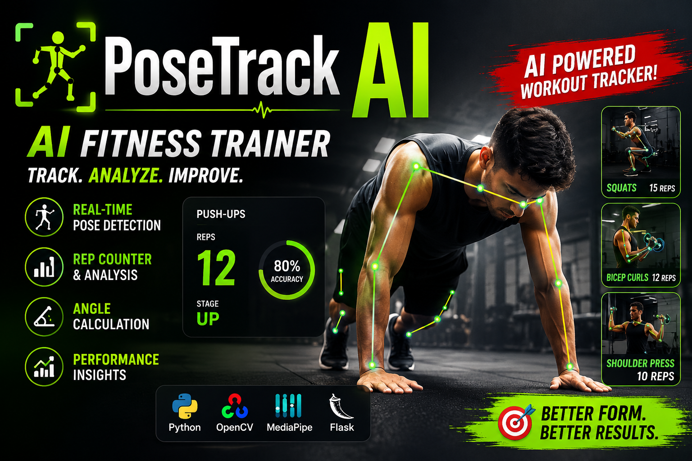

# PoseTrack AI 🏋️‍♂️

### Real-Time AI Fitness Coach Using Computer Vision & Pose Estimation

PoseTrack AI is a full-stack AI-powered fitness tracking platform that uses computer vision and pose estimation to analyze body movements in real time. The system tracks exercises, counts repetitions automatically, provides form feedback, calculates calories burned, and maintains workout history through an interactive web dashboard.

Built using Flask, MediaPipe, OpenCV, and modern web technologies, PoseTrack AI acts as a virtual fitness assistant capable of helping users monitor and improve workout performance directly through their webcam.
---

## 🎥 Demo

<p align="center">
  <a href="[https://youtu.be/YOUR_VIDEO_LINK](https://youtu.be/etn5ok5JK7A)">
    
  </a>
</p>

<p align="center">
  <b>▶️ Click the image to watch the full demonstration</b>
</p>

---

# 🚀 Key Features

### 🤖 AI-Powered Pose Detection

* Real-time body landmark detection using MediaPipe
* Accurate joint angle calculation
* Live pose tracking through webcam

### 💪 Intelligent Exercise Tracking

Supports automatic repetition counting for:

* Bicep Curl
* Squat
* Push Up
* Shoulder Press
* Lunge
* Deadlift
* Leg Raise
* Lateral Raise

### 📊 Workout Analytics

* Daily workout statistics
* Exercise history tracking
* Calories burned estimation
* Performance monitoring

### 👤 User Management

* Secure authentication system
* Personal workout records
* Individual fitness progress tracking

### 📁 Data Export

* Export workout history to CSV
* Download performance reports

---

# 🏗️ System Architecture

```text
User Webcam
      │
      ▼
MediaPipe Pose Detection
      │
      ▼
Body Landmark Extraction
      │
      ▼
Joint Angle Calculation
      │
      ▼
Exercise Recognition Logic
      │
      ▼
Repetition Counter
      │
      ▼
Calorie Estimation Engine
      │
      ▼
Workout History Storage
      │
      ▼
Analytics Dashboard
```

---

# 🛠️ Technology Stack

## Backend

* Python
* Flask
* Gunicorn

## Artificial Intelligence & Computer Vision

* MediaPipe
* OpenCV
* NumPy

## Frontend

* HTML5
* CSS3
* JavaScript
* Bootstrap

## Database & Storage

* SQLite
* CSV Export Support

---

### Supported Environment

✅ Full functionality available on Localhost

* Real-time camera access
* Live pose detection
* Exercise tracking
* Rep counting
* Form analysis

### To Experience the Complete Application

Clone the repository and run it locally:

```bash
git clone https://github.com/pn-dev-in/AI-Powered-Fitness-Tracking-System.git
cd AI-Powered-Fitness-Tracking-System
pip install -r requirements.txt
python app.py
```

Then open:

```text
http://127.0.0.1:5000
```

This provides full access to all AI-powered exercise tracking capabilities.


# 📂 Project Structure

```text
PoseTrack-AI/

├── controllers/
├── models/
├── services/
├── static/
├── templates/
├── tests/
├── utils/
├── user_data/
│
├── app.py
├── auth_utils.py
├── config.py
├── setup_db.py
│
├── Dockerfile
├── docker-compose.yml
├── render.yaml
├── requirements.txt
└── README.md
```

---

# 🎯 Supported Exercises

| Exercise       | Calories/Rep | Difficulty   |
| -------------- | ------------ | ------------ |
| Bicep Curl     | 0.5          | Beginner     |
| Squat          | 1.2          | Intermediate |
| Push Up        | 1.0          | Intermediate |
| Shoulder Press | 0.8          | Beginner     |
| Lunge          | 1.0          | Intermediate |
| Deadlift       | 1.5          | Advanced     |
| Leg Raise      | 0.7          | Beginner     |
| Lateral Raise  | 0.4          | Beginner     |

---

# 📸 Application Screenshots

### Signup Page


### Signin Page


### Dashboard


### Live Exercise Tracking


### AI Coach


### Analytics Dashboard


---

# ⚡ Local Installation

Clone the repository:

```bash
git clone https://github.com/pn-dev-in/AI-Powered-Fitness-Tracking-System.git

cd AI-Powered-Fitness-Tracking-System
```

Create virtual environment:

```bash
python -m venv venv
```

Activate environment:

### Windows

```bash
venv\Scripts\activate
```

### Linux / Mac

```bash
source venv/bin/activate
```

Install dependencies:

```bash
pip install -r requirements.txt
```

Initialize database:

```bash
python setup_db.py
```

Run application:

```bash
python app.py
```

Open:

```text
http://127.0.0.1:5000
```

---

# 🐳 Docker Setup

Build container:

```bash
docker build -t posetrack-ai .
```

Run container:

```bash
docker run -p 5000:5000 posetrack-ai
```

Using Docker Compose:

```bash
docker-compose up --build
```

---

# 🧪 Testing

Run project tests:

```bash
pytest
```

---

# 📈 Future Enhancements

* AI posture correction feedback
* Exercise auto-classification using ML
* Personalized workout recommendations
* Fitness goal tracking
* Mobile application
* Voice-enabled AI fitness coach
* Wearable device integration
* Advanced analytics and reporting

---

# 🎓 Skills Demonstrated

This project showcases practical experience in:

✅ Computer Vision

✅ Pose Estimation

✅ Artificial Intelligence

✅ Flask Web Development

✅ RESTful Application Design

✅ Authentication Systems

✅ Data Analytics

✅ Docker Containerization

✅ Cloud Deployment

✅ Software Architecture

---

# 📊 Project Highlights

* Real-time AI fitness monitoring
* 8 supported exercise types
* Automated repetition counting
* Live calorie estimation
* User authentication and session management
* Cloud-hosted production deployment
* Docker-ready infrastructure
* Exportable workout data

---

# 👨‍💻 Author

### Pravesh Nandanwar

GitHub: https://github.com/pn-dev-in

LinkedIn: www.linkedin.com/in/pravesh-nandanwar

---

# ⭐ Support

If you found this project useful, consider giving it a star on GitHub.

Contributions, suggestions, and feedback are always welcome.
